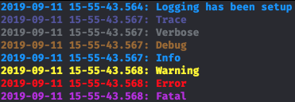
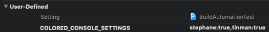

DependenciesDemo
============

[]()

## Developer Documentation

### Logging

The template provides built-in logging through the `Log<Flag>` functions. Flag may be one of:

- `Trace`/`Verbose`/`Debug`: Debug information about something in the app, `Trace` being messages that can be sent every frames, while `Debug` is any time a user action happens. `Verbose` is in between.
- `Info`: A general information about something that happened in the app, e.g. logging the push notification token.
- `Warning`: Something happened that the app didn't expect, e.g. the app expected a PNG but received a JPEG image or a deprecated response was received.
- `Error`: An error has happened that the app can recover from, e.g. an API error.
- `Fatal`: A fatal error has happened and the app cannot continue working, e.g. a programmer error where the wrong initializer was used.

The project supports having colored logs in the Xcode console:

<div style="text-align:center">
	
</div>

<br/>
To install them, you can follow the steps below:

0. The project must have been created through the Fueled project template.
1. Install the font available [here](https://github.com/stephanecopin/ColoredConsole/raw/fueled-colors/ColoredConsole-Bold.ttf).
2. When in Xcode, in the menu, click on Xcode > Preferences > Fonts & Colors
3. In the left column, click on the theme you're using (which should be selected by default)
4. In the right part, at the top, you'll see "Source Editor" & "Console": click on "Console"
5. Click on `Executable Console Output`, and in the font selector below select `Colored Console Bold` with your preferred font size.
6. In the project's "Build Settings", search for `COLORED_CONSOLE_SETTINGS`, and add a comma followed by `<your mac username>:true`. You can get your username by typing
	```bash
	echo $USER
	```
	in your terminal.  
	For example, if your username is `tinman`, the result could look like:
	
	<div style="text-align:center">
		
	</div>

> If you're feeling adventurous and want customize the colors, you can do so using the script available [there](https://github.com/stephanecopin/ColoredConsole/tree/fueled-colors).

### Tools

This project is set up to use a variety of tools destined for eliminating writing boilerplate code and catching potential issues as early as possible.

#### Arkana
[Arkana](https://github.com/rogerluan/arkana) is used to handle/manage/store project keys secretely. 


Arkana requires the declaration of a YAML config file, named e.g. `.arkana.yml` that lists the keys (names) and an `.env` (e.g. `.env.arkana`) file that stores the values for the keys stored in the YAML file. Since the `.env.arkana` file contains the actual values of the secrets, it should be stored locally and never be checked-in to the repository (It has already been added to `.gitignore`). 

**To generate the secrets file (or ArkanaKeys framework) here are the steps required:**

- Duplicate the `.env.arkana_ci` file and renamed the copied file to `.env.arkana`
- If you're adding a new secret, add appropriate keys to both `env.arkana_ci` and `.env.arkana` files. Add a corresponding secret on Github Action secrets and update the workflow files (e.g. `.github/workflows/deploy-alpha_snapshot.yml`) to pass the secret as environment variables for the CI to work. Also add the secrets to 1Password vault so that it's available for other team members to access. 
- If you're cloning the repo for the first time, replace the placeholder values in `.env.arkana` with actual secrets which ideally should be available in the 1Password vault for the project.
- Finally run the following command in Terminal `bundle exec arkana -c .arkana.yml -e .env.arkana` and you should be good. 


#### SwiftLint

[SwiftLint](https://github.com/realm/SwiftLint/) is a tool that parses `swift` files and outputs warnings when a code smell is identified.

Sometimes, SwiftLint outputs warnings for desired code, and in these cases, the warning can be manually disabled. For example, the following snippet outputs the warning with ID `private_outlet` (the ID is always at the end of the warning):
```swift
@IBOutlet private var button: UIButton!
// This generates a warning by default due to the `@IBOutlet`'s getter not being `private`/`fileprivate`. The ID of the warning is `private_outlet`
@IBOutlet weak var delegate: MyDelegate!
@IBOutlet private var textView: UITextView!
```
You can disable it in any of the following ways:
```swift
@IBOutlet private var button: UIButton!
@IBOutlet weak var delegate: MyDelegate! // swiftlint:disable:this private_outlet
@IBOutlet private var textView: UITextView!
```
```swift
@IBOutlet private var button: UIButton!
// swiftlint:disable:next private_outlet
@IBOutlet weak var delegate: MyDelegate!
@IBOutlet private var textView: UITextView!
```
```swift
@IBOutlet private var button: UIButton!
@IBOutlet weak var delegate: MyDelegate!
// swiftlint:disable:previous private_outlet
@IBOutlet private var textView: UITextView!
```
```swift
// This disables the warning for the entire file _after_ this line
// This is NOT recommended and should be avoided
// swiftlint:disable private_outlet

@IBOutlet private var button: UIButton!
@IBOutlet weak var delegate: MyDelegate!
@IBOutlet private var textView: UITextView!
```

> Please note that disabling rules in general is discouraged, except for specific use-case as the example above.

#### Sourcery

[Sourcery](https://github.com/krzysztofzablocki/Sourcery) is a tool allowing to parse the app's codebase, and generate code based on the code structure. It has 3 templating engines:

- Stencil
- Swift
- Javascript (not used in this project)

Sourcery also allows to *annotations* to any Swift element, in the form `// sourcery: <...>`. This

##### Templates

Five templates are bundled with the project by defaults, described below (with the template language they're written in in between parentheses).

> Generated code is generally not written to be read, as opposed to what we write ourselves, and thus the generated code can be very hard to read. While efforts are made to make it legible, it's more important to have the **template** more readable that the code it generates.

###### PluggableApplicationDelegate (swift)

This template allows to declare classes implementing the `ApplicationService` protocol, avoiding the creation of a massive `UIApplicationDelegate`. There can be any number of classes implementing the same delegate methods.

The class can either be declared as-is, or as a singleton by exposing a `static` property called `shared`.

> Note that this template is considered production-ready, if any issues arise from using it please do slack `stephane` or email [stephane@fueled.com](mailto:stephane@fueled.com)

> For details on the inner working, don't hesitate to check the template itself `PluggableApplicationDelegate.swifttemplate` or the generated code file `PluggableApplicationDelegate.generated.swift`.

Examples:
```swift
final class GarageAppService: NSObject, ApplicationService {
	func application(_ application: UIApplication, didFinishLaunchingWithOptions launchOptions: [UIApplication.LaunchOptionsKey: Any]? = nil) -> Bool {
		// ...

		return false
	}
}
```
---
```swift
final class EnvironmentAppService: NSObject, ApplicationService {
	static let shared = EnvironmentAppService()

	func application(_ application: UIApplication, didFinishLaunchingWithOptions launchOptions: [UIApplication.LaunchOptionsKey: Any]? = nil) -> Bool {
		// ...

		return false
	}
}
```
<br/>
###### AutoEquatable (stencil)

Types annotated `AutoEquatable` allows Sourcery to automatically try to synthesize a `Equatable` implementation for the given type, which allows combined with the annotation `skipEquality`, which allows to tell Sourcery to skip a member when synthesizing, it allows to reduce the amount of boilerplate code written (as the compiler-generated implementation always take into account all cases).

Examples:
```swift
// sourcery: AutoEquatable
enum ButtonShape {
	case square
	case radial(cornerRadius: CGFloat)
	case circular
	case angled
}

print(ButtonShape.square == ButtonShape.square) // `true`
print(ButtonShape.square == ButtonShape.radial(1.0)) // `false`
print(ButtonShape.radial(0.0) == ButtonShape.radial(1.0)) // `false`
print(ButtonShape.radial(1.0) == ButtonShape.radial(1.0)) // `true`

```
----
```swift
// sourcery: AutoEquatable
enum ButtonShape {
	case square
	// This will skip generating equality for the associated values
	// sourcery: skipEquality
	case radial(cornerRadius: CGFloat)
	case circular
	case angled
}

print(ButtonShape.square == ButtonShape.square) // `true`
print(ButtonShape.square == ButtonShape.radial(1.0)) // `false`
print(ButtonShape.radial(0.0) == ButtonShape.radial(1.0)) // `true`
print(ButtonShape.radial(1.0) == ButtonShape.radial(1.0)) // `true`
```

<br/>
###### AutoHashable (stencil)

As with `AutoEquatable`, types annotated `AutoHashable` allows Sourcery to automatically try to synthesize a `Hashable` implementation for the given type. This is useful for `enum` with associated values, as the compiler is not yet able to do so yet. Combined with the annotation `skipEquality`, which allows to tell Sourcery to skip a member when synthesizing, it allows to reduce the amount of boilerplate code written.

> Note that `AutoHashable` doesn't imply `AutoEquatable` when annotated, so make sure in that case to also specify `AutoEquatable`

Examples:
```swift
// sourcery: AutoEquatable, AutoHashable
enum ButtonShape {
	case square
	case radial(cornerRadius: CGFloat)
	case circular
	case angled
}

print(Set([
	ButtonShape.square
	ButtonShape.square
	ButtonShape.radial(0.0)
	ButtonShape.radial(1.0)
])
// [
// 	ButtonShape.square,
// 	Shape.radial(0.0),
// 	Shape.radial(1.0),
// ]
// (order is random)
```
----
```swift
// sourcery: AutoEquatable, AutoHashable
enum ButtonShape {
	case square
	// This will skip generating equality & hashing for the associated values
	// sourcery: skipEquality, skipHashing
	case radial(cornerRadius: CGFloat)
	case circular
	case angled
}

print(Set([
	ButtonShape.square
	ButtonShape.square
	ButtonShape.radial(0.0)
	ButtonShape.radial(1.0)
])
// [
// 	ButtonShape.square,
// 	Shape.radial(0.0),
// ]
// **OR**
// [
// 	ButtonShape.square,
// 	Shape.radial(1.0),
// ]
// (order is random)
```

> For the last example, keep in mind that Hashing generates random hashes, and thus if the associated is not used when generating the hash, the value that will be present at runtime can be **any of the two**.

<br/>
###### EnumDefaults (swift)

This template allows to add default values to `enum` with associated values. This is best explained with an example:
```swift
// sourcery: AutoEquatable, AutoHashable
enum Test {
	// sourcery: case = "true"
	case case1(case: Bool)
	case case2(Bool)
	// sourcery: test = "false", 2 = "nil"
	case case3(Int, test: Bool, Int?)
}
```
Which will synthesize default methods allowing to use the enumeration without having to specify _all_ values:
```swift
print(Test.case1) // Test.case1(case: true)
print(Test.case3(0, 5)) // Test.case3(0, test: false, 5)
print(Test.case3(1, test: true)) // Test.case3(1, test: true, nil)
```

<br/>
###### AutoInit (stencil)

This template allows to do multiple things:

- Automatically generate protocol implementations
- Automatically generate initializers

Examples:
```swift
// sourcery: GenerateImplementation
public protocol Token {
	var value: String { get }
	// sourcery: default = "nil"
	var user: User? { get }
}
```
Which will generate:
```
public struct TokenImplementation: Token {
  let value: String
  let user: User? = nil

  internal init(
    value: String,
    user: User? = nil)
  {
    self.value = value
    self.user = user
  }
}
```
----
The generated type, name and visibility can be tweaked as follow:

```swift
// sourcery: GenerateImplementation, implementationVisibility="internal", type = "final class", prefix = "Test", suffix = ""
public protocol Token {
	var value: String { get }
	// sourcery: default = "nil"
	var user: User? { get }
}
```
Which will generate:
```swift
internal final class TestToken: Token {
  let value: String
  let user: User? = nil

  internal init(
    value: String,
    user: User? = nil)
  {
    self.value = value
    self.user = user
  }
}
```

> If `implementationVisibility` is not specified, it defaults to the visibility of the protocol

----
```swift
// sourcery: GenerateInitializer
public struct Token {
	var value: String { get }
	// sourcery: default = "nil"
	var user: User? { get }
}
```
Which will generate (inline):
```
// sourcery: GenerateInitializer, initVisibility="internal"
public struct Token {
	var value: String { get }
	// sourcery: default = "nil"
	var user: User? { get }

// sourcery:inline:auto:Token.GenerateInit
  internal init(
    value: String,
    user: User? = nil)
  {
    self.value = value
    self.user = user
  }
// sourcery:end
}
```
> If `initVisibility` is not specified, it defaults to the visibility of the type

###### AutoCodable (swifttemplate)

This template allows to generate the basic boilerplate code for `Decodable`/`Encodable`. For example, given the following `User` object:
```swift
// sourcery: AutoDecodable, AutoEncodable
struct User {
	let accessToken: String // By default, the template will convert camelCase to snake_case, and be overriden like in the example below
	// sourcery: key = "access_token_expires_at"
	let accessTokenExpirationDate: Int
	let email: String
	let firstName: String?
	let lastName: String?
}
```
Which will generate:
```swift
extension User: Decodable, Encodable {
	enum CodingKeys: String, CodingKey {
		case accessToken = "access_token"
		case accessTokenExpirationDate = "access_token_expires_at"
		case email
		case firstName = "first_name"
		case lastName = "last_name"
	}

	init(from decoder: Decoder) throws {
		let container = try decoder.container(keyedBy: CodingKeys.self)
		self.accessToken = try container.decode(String.self, forKey: .accessToken)
		self.accessTokenExpirationDate = try container.decode(Int.self, forKey: .accessTokenExpirationDate)
		self.email = try container.decode(String.self, forKey: .email)
		self.firstName = try container.decodeIfPresent(String.self, forKey: .firstName)
		self.lastName = try container.decodeIfPresent(String.self, forKey: .lastName)
	}

	func encode(to encoder: Encoder) throws {
		var container = encoder.container(keyedBy: CodingKeys.self)
		try container.encode(self.accessToken, forKey: .accessToken)
		try container.encode(self.accessTokenExpirationDate, forKey: .accessTokenExpirationDate)
		try container.encode(self.email, forKey: .email)
		try container.encodeIfPresent(self.firstName, forKey: .firstName)
		try container.encodeIfPresent(self.lastName, forKey: .lastName)
	}
}
```

The generated code also defines two custom protocols, `RawDecodable` and `RawEncodable` that can be used to decode/encode types that implements `RawRepresentable`.

The template offer a minimal amount of customization, allowing for example to:

- Just generate the `FieldsKey` enumeration (by only specifying the `AutoFieldsKey` annotation)
  This is helpful when the `init`/`encode` requires special handling, but allows to avoid maintaining the enum.
```swift
// sourcery: FieldsKey
struct User {
	let accessToken: String
	// sourcery: key = "access_token_expires_at"
	let accessTokenExpirationDate: Int
	let email: String
	let firstName: String?
	let lastName: String?
}
```
Will generate:
```swift
// Note that neither there is no `Decodable` nor `Encodable` conformance
extension User {
	enum CodingKeys: String, CodingKey {
		case accessToken = "access_token"
		case accessTokenExpirationDate = "access_token_expires_at"
		case email
		case firstName = "first_name"
		case lastName = "last_name"
	}
}
```

- Define custom types to decode from:
```swift
private let dateFormatter: DateFormatter // Initialization omitted for brievity

extension KeyedDecodingContainer {
	func decode(_ type: String.Type, forKey key: KeyedDecodingContainer<K>.Key) thows -> Date {
		let dateString: String = try self.decode(String.self, forKey: key)
		return dateFormatter.date(from: dateString)
      ?? { throw DecodingError.dataCorrupted(.init(codingPath: self.codingPath, debugDescription: "Failed to decode date for key \(key)")) }()
	}
}

// sourcery: AutoDecodable, AutoEncodable, GenerateImplementation
struct Post {
	let content: String
	// sourcery: decodingType = "String"
	let creationDate: Date
}
```
Will generate:
```swift
extension Post: Decodable {
	enum CodingKeys // Implementation omitted for brievity

	init(from decoder: Decoder) throws {
		let container = try decoder.container(keyedBy: CodingKeys.self)
		self.content = try container.decodeIfPresent(String.self, forKey: .content)
    // Note how `String` is used here as specified by the annotation, so the method defined above is called
		self.creationDate = try container.decode(String.self, forKey: .creationDate)
	}
}
```

- Define custom property path to encode to:
```swift
private let dateFormatter: DateFormatter // Initialization omitted for brievity

extension Date {
  extension day: String {
    return dateFormatter.string(from: self)
  }
}

// sourcery: AutoDecodable, AutoEncodable, GenerateImplementation
struct Post {
	let content: String
	// sourcery: encodedPath = "day"
	let creationDate: Date
}
```
Will generate:
```swift
extension Post: Encodable {
	enum CodingKeys // Implementation omitted for brievity

	func encode(to encoder: Encoder) throws {
		var container = encoder.container(keyedBy: CodingKeys.self)
		try container.encode(self.content, forKey: .content)
		try container.encode(self.creationDate.day, forKey: .creationDate)
	}
}
```

The template also supports generating `Decodable`/`Encodable` implementations for `enum`s. It supports `enum` with and without associated values.

- If the enum conforms to `RawRepresentable`, the value will be decoded from/encoded to the raw value.
- If the enum doesn't, a property `type` will be used to know what cases the enum is, and decode the case according to its individual values. For example, given:
```swift
// sourcery: AutoDecodable, AutoEncodable
enum RoomCell {
	// sourcery: AutoDecodable, AutoEncodable
	enum Feature: String {
		case fan
		case speaker
		// swiftlint:disable identifier_name
		case tv
	}

	// sourcery: key = "none"
	case empty
	case feature(/* sourcery: key = "feature" */ Feature)
	case seat(id: String?)
}
```
A new `type` property will be used to define the basic type of the enumeration (`none`, `feature` or `seat`, correspoding to `empty`, `feature` and `seat` respectively).  
For the given type, the resulting implementation will automatically decode/encode the type, and process with decoding/encoding the associated values.

###### Side note

As a side note, you can also combine everything presented here together. For example:
```swift
// sourcery: AutoDecodable, AutoEncodable, GenerateImplementation
struct Post {
	let accessToken: String
	// sourcery: key = "access_token_expires_at", decodingType = "String", encodedPath = "day"
	let accessTokenExpirationDate: Date
	let email: String
	// sourcery: default = "nil"
	let firstName: String?
	// sourcery: default = "nil"
	let lastName: String?
}
```

<br/>
##### Writing templates

A full documentation is available [at this address](https://cdn.rawgit.com/krzysztofzablocki/Sourcery/master/docs/) for writing templates, and a helpful guide is available [here](https://github.com/krzysztofzablocki/Sourcery/blob/master/guides/Writing%20templates.md).  
> When using Swift templates, the exact same types are used and the full power of the Swift language is available to you when writing your template.

Stencil templates are easier to read in general that Swift ones, and this should be the preferred language if the template doesn't require advanced logic.

### Project Structure

The project structure is as follow (Every new file should be created using that structure). The physical file structure should match the Xcode groups (names in _italic_ are folder names):

  - _Code_
    - _Application_
      - ApplicationService.swift
      - Constants.swift
      - EnvironmentConfiguration.swift
      - _Services_
    - _Helpers_
      - _Classes_
      - _Errors_
      - _Extensions_
      - _Generated_
    - _UI_
      - _Common_
        - _Localizable_
      - _&lt;Flow Name&gt;_
        - &lt;Flow Name&gt;.storyboard
        - _Screen1_
          - Screen1ViewController.swift
          - Screen1ViewController.swift
        - _Screen2_
          - Screen2ViewController.swift
          - Screen2ViewController.swift
        - _..._
    - _Models_
  - _Resources_
    - Dev/Prod entitlements
    - Assets.xcassets
    - _Fonts_
      - [Font Names]
    - _Localization_
      - Localizable.strings
      - Localizable.stringsdict
    - Settings.bundle
    - Info.plist
  - _Tests_
  - _Products_
  - _Pods_
  - _Frameworks_
